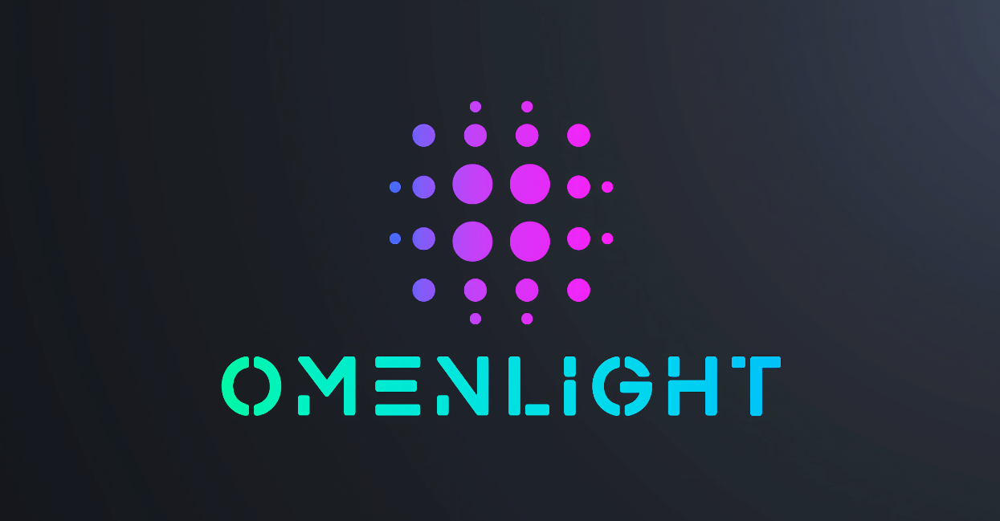

# Omenlight – High Contrast Themes

A vibrant collection of high-contrast VSCode themes designed for clarity and aesthetics.  
Perfect for developers who want a visually striking, neon-inspired dark theme with excellent readability.

---

## Included Themes

- **Omenlight - Aetherglow**
- **Omenlight - Bloodveil**
- **Omenlight - Edenblush**
- **Omenlight - Frostflame**
- **Omenlight - Lilascape**
- **Omenlight - Neonwave**
- **Omenlight - Rosequill**
- **Omenlight - Solflare**
- **Omenlight - Toxira**
- **Omenlight - Vermintis**

---

## Features

- High contrast and vibrant neon colors
- Carefully crafted color palettes for syntax highlighting
- Dark UI to reduce eye strain during long coding sessions
- Supports various programming languages out of the box

---

## Installation

1. Search for **Omenlight – High Contrast Themes** in the VSCode Extensions Marketplace.  
2. Click **Install**.  
3. Go to **Preferences > Color Theme** and select your preferred Omenlight theme.

---

## Usage

After installation, open the **Command Palette** (`Ctrl+Shift+P` or `Cmd+Shift+P`), then type `Color Theme` and choose one of the Omenlight themes.

---

## Feedback and Contributions

Feel free to open issues or submit pull requests on [GitHub](https://github.com/bbelbuken/omenlight-theme-pack).

---

## License

This project is licensed under the MIT License. See the [LICENSE](LICENSE) file for details.

---

Enjoy your coding with Omenlight!